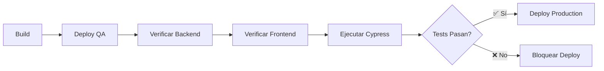

# 🧪 Integración de Cypress E2E Tests en Azure Pipeline

## ✅ Configuración Completada

### 1. **Stage E2E Tests Agregado al Pipeline**

El pipeline ahora incluye un nuevo stage que se ejecuta **después del deploy a QA** y **antes del deploy a Producción**:

```yaml
Build → Deploy QA → E2E Tests (Cypress) → Deploy Production
```

### 2. **Flujo de Ejecución**



## 📋 Características Implementadas

### Tests E2E con Cypress
- ✅ **5 tests automatizados**:
  - `0-smoke-test.cy.js` - Verificación básica de carga
  - `1-crear-producto.cy.js` - Creación de productos
  - `2-actualizar-producto.cy.js` - Actualización de productos
  - `3-validacion-errores.cy.js` - Validación de errores (3 tests)

### Validaciones Pre-Test
- ✅ Verificación de disponibilidad del Backend QA (30 intentos, 10s cada uno)
- ✅ Verificación de disponibilidad del Frontend QA (30 intentos, 10s cada uno)
- ✅ Timeouts configurables para esperar que los servicios estén listos

### Reportes y Artefactos
- ✅ Resultados en formato JUnit (integrado con Azure DevOps)
- ✅ Screenshots automáticos en caso de fallos
- ✅ Videos de todas las ejecuciones
- ✅ Publicación automática de artefactos

## 🔧 Configuración del Pipeline

### Variables Configuradas

```yaml
# En azure-pipelines.yml (líneas 6-34)
variables:
  nodeVersion: '20.x'
  
  # URLs QA
  webAppNameBackendQA: 'repuestera-api-qa'
  webAppNameFrontendQA: 'repuestera-web-qa'
  apiUrlQA: 'https://repuestera-api-qa.azurewebsites.net/api'
  
  # Cypress (opcional para Dashboard)
  # cypressRecordKey: $(CYPRESS_RECORD_KEY)
```

### Stage E2E Tests

```yaml
- stage: E2ETests
  displayName: '🧪 E2E Tests (Cypress)'
  dependsOn: DeployQA
  condition: succeeded()
```

**Características:**
- Se ejecuta solo si el deploy a QA es exitoso
- Bloquea el deploy a producción si falla
- Publica resultados, screenshots y videos

## 🚀 Ejecución en el Pipeline

### Paso a Paso

1. **Instalación**
   ```bash
   npm install
   npm install -D cypress@15.6.0
   ```

2. **Verificación de Servicios**
   - Backend: `curl $(apiUrlQA)/health`
   - Frontend: `curl https://$(webAppNameFrontendQA).azurewebsites.net`
   - Reintentos: 30 intentos con 10s de espera cada uno

3. **Ejecución de Tests**
   ```bash
   CYPRESS_BASE_URL="https://repuestera-web-qa.azurewebsites.net"
   CYPRESS_API_URL="https://repuestera-api-qa.azurewebsites.net/api"
   
   npx cypress run \
     --spec "cypress/e2e/*.cy.js" \
     --config baseUrl=$CYPRESS_BASE_URL \
     --reporter junit
   ```

4. **Publicación de Resultados**
   - JUnit XML → Azure Test Results
   - Screenshots → Artefactos
   - Videos → Artefactos

## 📊 Resultados en Azure DevOps

### Test Results Tab
Verás:
- ✅ 5/5 tests passing (o el estado actual)
- Duración total (~53 segundos esperados)
- Desglose por archivo de test
- Historial de ejecuciones

### Artifacts
Disponibles para descargar:
- `cypress-screenshots/` - Screenshots de fallos
- `cypress-videos/` - Videos completos de ejecución

### Pipeline Summary
```
✅ Build (Backend + Frontend)
✅ Deploy QA
✅ E2E Tests (Cypress) - 5 tests passed
⏸️  Deploy Production (esperando aprobación)
```

## 🧪 Ejecución Local vs Pipeline

| Aspecto | Local | Pipeline |
|---------|-------|----------|
| **URL Base** | localhost:3000 | https://repuestera-web-qa.azurewebsites.net |
| **API URL** | localhost:8000 | https://repuestera-api-qa.azurewebsites.net/api |
| **Reporter** | Spec (terminal) | JUnit (Azure DevOps) |
| **Videos** | Optional | Always |
| **Screenshots** | On failure | On failure |
| **Resultados** | Local | Publicados en Azure |

## 📝 Configuración de cypress.config.js

```javascript
module.exports = defineConfig({
  e2e: {
    // URLs configurables por variables de entorno
    baseUrl: process.env.CYPRESS_BASE_URL || 'http://localhost:3000',
    
    env: {
      apiUrl: process.env.CYPRESS_API_URL || 'http://localhost:8000/api',
      adminEmail: 'admin@repuestera.com',
      adminPassword: 'admin123'
    },
    
    // Reporter según entorno
    reporter: process.env.CI ? 'junit' : 'spec',
    reporterOptions: {
      mochaFile: 'cypress/results/cypress-results-[hash].xml',
      toConsole: true
    },
    
    // Timeouts ajustados para Azure
    defaultCommandTimeout: 10000,
    pageLoadTimeout: 60000,
    requestTimeout: 10000,
    responseTimeout: 30000,
  },
})
```

## 🔒 Protección de Producción

El deploy a producción **SOLO se ejecuta si:**
- ✅ Build exitoso
- ✅ Deploy a QA exitoso
- ✅ **Todos los tests E2E pasan**
- ✅ Aprobación manual (si está configurada)

## 🛠️ Troubleshooting

### Tests fallan en Pipeline pero pasan localmente

**Posibles causas:**
1. **Timeouts**: Los servicios en Azure tardan más en responder
   - Solución: Aumentar `pageLoadTimeout` y `defaultCommandTimeout`

2. **URLs incorrectas**: Variables de entorno mal configuradas
   - Solución: Verificar `webAppNameFrontendQA` y `apiUrlQA`

3. **Base de datos**: Estado inconsistente entre ejecuciones
   - Solución: Limpiar datos de test o usar datos seed consistentes

4. **Autenticación**: Credenciales de admin no existen en QA
   - Solución: Agregar script de inicialización en backend QA

### Ver logs detallados

En Azure DevOps:
```
Pipeline → Run → E2E Tests → Cypress Tests
→ Click en "Ejecutar Cypress E2E Tests en QA"
→ Ver logs completos en tiempo real
```

### Descargar videos y screenshots

```
Pipeline → Run → Artifacts
→ cypress-screenshots (si hubo fallos)
→ cypress-videos (todas las ejecuciones)
→ Download
```

## 📈 Métricas de Calidad

Con esta integración obtienes:

### Tests Automatizados
- **Unitarios** (Backend): 197 tests, 77.31% coverage
- **Unitarios** (Frontend): En progreso
- **E2E** (Cypress): 5 tests, flujos completos

### Análisis Estático
- **SonarCloud**: Bugs, vulnerabilities, code smells
- **Quality Gate**: Bloquea merges con código de mala calidad

### Validación Pre-Producción
- **Deploy automático a QA**
- **E2E tests en QA**
- **Solo código validado va a producción**

## 🎯 Quality Gates del Pipeline

| Gate | Requisito | Acción si falla |
|------|-----------|-----------------|
| **Build** | Sin errores de compilación | ❌ Detener pipeline |
| **Unit Tests** | 197 tests pasan | ❌ Detener pipeline |
| **SonarCloud** | Quality Gate pass | ⚠️ Advertencia (configurable) |
| **Deploy QA** | Exitoso | ❌ Detener pipeline |
| **E2E Tests** | 5/5 tests pasan | ❌ **Bloquear Producción** |
| **Manual Approval** | Aprobación del equipo | ⏸️ Esperar aprobación |

## 🚀 Próximos Pasos

1. **Ahora**: Hacer commit y push para ejecutar el pipeline completo
   ```bash
   git add azure-pipelines.yml cypress.config.js
   git commit -m "CI/CD: Integrar Cypress E2E tests en pipeline"
   git push
   ```

2. **Monitorear**: Ver la ejecución en Azure DevOps
   - Build stage
   - Deploy QA
   - **E2E Tests (nuevo)**
   - Deploy Production

3. **Optimizar** (después del primer run exitoso):
   - Ajustar timeouts si es necesario
   - Agregar más tests E2E
   - Configurar Cypress Dashboard (opcional)

## 📚 Documentación Adicional

- **Cypress en CI/CD**: https://docs.cypress.io/guides/continuous-integration/introduction
- **Azure Pipelines YAML**: https://docs.microsoft.com/azure/devops/pipelines/yaml-schema
- **Cypress Azure Integration**: https://docs.cypress.io/guides/continuous-integration/azure-devops

---

## ✅ Checklist de Implementación

- [x] Stage E2E Tests agregado al pipeline
- [x] Variables de entorno configuradas
- [x] cypress.config.js actualizado para CI/CD
- [x] Verificaciones de servicios pre-test
- [x] Reporter JUnit configurado
- [x] Publicación de artefactos (screenshots/videos)
- [x] Bloqueo de producción si tests fallan
- [ ] **Ejecutar primer pipeline completo**
- [ ] Verificar resultados en Azure DevOps
- [ ] Documentar métricas para el TP

**¡Todo listo para hacer push y ver los E2E tests en acción! 🚀**
