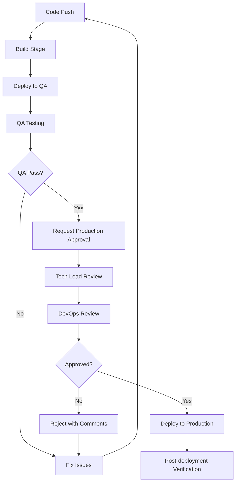

# Configuración de Aprobaciones Manuales - Azure DevOps
## TP05 - Release Pipeline con Environments

### 📋 **Objetivo**
Configurar aprobaciones manuales para el despliegue a producción, asegurando control de calidad y responsabilidad en releases críticos.

---

## 🏗️ **1. Configuración de Environments en Azure DevOps**

### **Paso 1: Acceder a Environments**
1. Ve a tu proyecto en Azure DevOps
2. Navega a **Pipelines** → **Environments**
3. Crea los siguientes environments:

### **Environments Requeridos:**

#### **QA Environments (Sin Aprobación)**
```
Nombre: qa-backend
Descripción: Backend QA Environment - Auto Deploy
Aprobaciones: Ninguna
```

```
Nombre: qa-frontend  
Descripción: Frontend QA Environment - Auto Deploy
Aprobaciones: Ninguna
```

#### **Production Environments (Con Aprobación Manual)**
```
Nombre: production-backend
Descripción: Backend Production Environment - Manual Approval Required
Aprobaciones: Manual (Ver configuración abajo)
```

```
Nombre: production-frontend
Descripción: Frontend Production Environment - Manual Approval Required  
Aprobaciones: Manual (Ver configuración abajo)
```

---

## 🔐 **2. Configuración de Aprobaciones Manuales**

### **Para cada Production Environment:**

#### **Paso 1: Configurar Approvers**
1. Entra al environment `production-backend`
2. Click en **"..."** → **Approvals and checks**
3. Click **"+"** → **Approvals**

#### **Paso 2: Configurar Approval Settings**
```yaml
Approvers:
  - Tech Lead (usuario principal)
  - DevOps Engineer (usuario secundario)
  
Approval Policy:
  - Require approval from: "Any one user"
  - Allow approvers to approve their own runs: No
  - Timeout: 30 days
  
Instructions for approvers:
  "Revisar cambios en QA, verificar tests, y aprobar deployment a producción"
```

#### **Paso 3: Configurar Pre-deployment Conditions**
```yaml
Pre-deployment approvals:
  - Enabled: Yes
  - Required approvers: 1
  - Allow override: No
  
Timeout:
  - 30 days (máximo tiempo de espera)
  
Retry policy:
  - Number of retries: 0
```

---

## 👥 **3. Responsables y Roles**

### **Matriz de Responsabilidades:**

| Rol | Responsabilidad | Environment | Acción |
|-----|----------------|-------------|---------|
| **Developer** | Desarrollo y testing inicial | QA | Push código |
| **QA Tester** | Testing en ambiente QA | QA | Validar funcionalidad |
| **Tech Lead** | Revisión técnica | Production | Aprobar deployment |
| **DevOps Engineer** | Infraestructura y monitoring | Production | Aprobar deployment |
| **Product Owner** | Validación funcional | Production | Revisar features |

### **Proceso de Aprobación:**



---

## 📧 **4. Configuración de Notificaciones**

### **Notificaciones Automáticas:**

#### **Para Approvers:**
```yaml
Triggers:
  - Approval requested
  - Approval timeout warning (24h before)
  - Deployment completed
  - Deployment failed

Channels:
  - Email
  - Microsoft Teams (opcional)
  - Azure DevOps notifications
```

#### **Para Development Team:**
```yaml
Triggers:
  - Approval granted
  - Approval rejected
  - Deployment started
  - Deployment completed
  - Deployment failed

Channels:
  - Email
  - Slack/Teams integration
```

---

## 🛠️ **5. Configuración Paso a Paso**

### **Configurar production-backend Environment:**

1. **Crear Environment:**
   ```bash
   Pipelines → Environments → New environment
   Name: production-backend
   Description: Backend Production - Manual Approval Required
   ```

2. **Agregar Approval Check:**
   ```bash
   Environment → Approvals and checks → + → Approvals
   ```

3. **Configurar Approvers:**
   ```yaml
   Approvers: [tu-email@domain.com]
   Policy: Any one user
   Timeout: 30 days
   Instructions: "Verificar QA testing y aprobar deployment a producción"
   ```

4. **Repetir para production-frontend**

### **Configurar Notificaciones:**

1. **Project Settings → Notifications**
2. **New subscription → Build and release**
3. **Configurar triggers específicos**

---

## 📊 **6. Testing del Proceso**

### **Checklist de Verificación:**

#### **QA Environment:**
- [ ] Deployment automático funciona
- [ ] Variables QA configuradas correctamente
- [ ] Aplicación accesible en URLs QA
- [ ] Logs y monitoring funcionando

#### **Production Environment:**
- [ ] Approval request se genera automáticamente
- [ ] Notificaciones llegan a approvers
- [ ] Approval/rejection funciona correctamente
- [ ] Deployment se ejecuta solo después de approval
- [ ] Variables production configuradas correctamente

### **Escenarios de Testing:**

1. **Happy Path:**
   - Push → Build → QA → Approval → Production ✅

2. **Rejection Path:**
   - Push → Build → QA → Rejection → Fix → Retry ✅

3. **Timeout Path:**
   - Push → Build → QA → Timeout → Manual intervention ✅

---

## 🚨 **7. Troubleshooting**

### **Problemas Comunes:**

#### **Approval no se solicita:**
```bash
Verificar:
- Environment name en pipeline coincide exactamente
- Approval check está configurado
- Usuario tiene permisos en el environment
```

#### **Notificaciones no llegan:**
```bash
Verificar:
- Email configurado en Azure DevOps profile
- Subscription de notificaciones activa
- Filtros de spam en email
```

#### **Deployment falla después de approval:**
```bash
Verificar:
- Service connection tiene permisos
- Recursos Azure existen
- Variables están configuradas correctamente
```

---

## 📈 **8. Métricas y Monitoring**

### **KPIs a Monitorear:**

- **Approval Time:** Tiempo promedio de aprobación
- **Rejection Rate:** Porcentaje de deployments rechazados
- **Deployment Success Rate:** Tasa de éxito post-approval
- **Rollback Frequency:** Frecuencia de rollbacks

### **Dashboard Recomendado:**
```yaml
Widgets:
  - Deployment frequency
  - Lead time for changes
  - Mean time to recovery
  - Change failure rate
```

---

## 🎯 **9. Próximos Pasos**

1. **Implementar configuración básica**
2. **Testing con deployment real**
3. **Ajustar proceso basado en feedback**
4. **Documentar lecciones aprendidas**
5. **Expandir a otros proyectos**

---

**Fecha:** Enero 2025  
**Autor:** TP05 Team  
**Versión:** 1.0  
**Estado:** Ready for Implementation